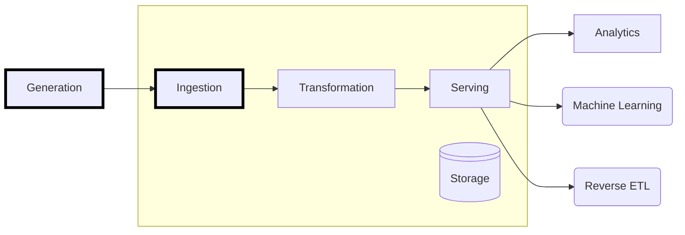
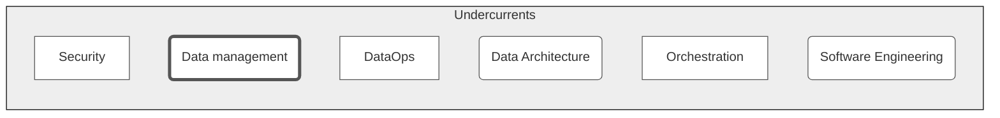

+++
title = "Data Acquisition and Reduction"
type = "chapter"
weight = 1

[params]
  menuPre = '<i class="fa-solid fa-download"></i> '
+++

In our first quest of data engineering, we will consider the task of acquiring data into our local environment before it can be further processed. 

https://www.data.gov.uk/dataset/81cbf1a0-6304-470c-ade8-60272be0d219/sites-of-biological-importance-sbi-in-greater-manchester

