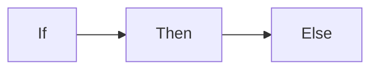

+++
title = "Markdown Cheatsheet (INTERNAL HUGO GUIDANCE)"
hidden = true
+++

From <https://mcshelby.github.io/hugo-theme-relearn/authoring/markdown/>

> [!CAUTION]
> Advises about risks or negative outcomes of certain actions.

> [!IMPORTANT]
> Key information users need to know to achieve their goal.

> [!INFO]
> Information that users <ins>_might_</ins> find interesting.

> [!NOTE]
> Useful information that users should know, even when skimming content.

> [!TIP]
> Helpful advice for doing things better or more easily.

> [!WARNING]
> Urgent info that needs immediate user attention to avoid problems.

> [!primary] There may be pirates
> It is all about the boxes.

> [!secondary] There may be pirates
> It is all about the boxes.

> [!accent] There may be pirates
> It is all about the boxes.

{}
A **primary** disclaimer
{}


{}
A **secondary** disclaimer
{}

{}
An **accent** disclaimer
{}

> [!tip] Callouts can have custom titles
> Like this one.

> [!tip] Title-only callout

> [!note]- Are callouts foldable?
> Yes! In a foldable callout, the contents are hidden when the callout is collapsed

> [!note]+ Are callouts foldable?
> Yes! In a foldable callout, the contents are hidden when the callout is collapsed



https://mermaid.js.org/syntax/flowchart.html


<!-- attachments -->
{}


{}
```python
print("Hello World!")
```
{}
{}
```bash
echo "Hello World!"
```
{}
{}
```c
printf"Hello World!");
```
{}


{}
- home | folder
  - [.config](http://example.com) | folder
  - My Documents | folder | magic
    - home.php | fa-fw fab fa-php | #888cc4
{}

