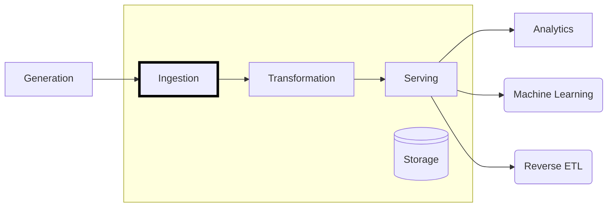

+++
title = "Shape of Data"
type = "chapter"
weight = 2

[params]
  menuPre = '<i class="fa-solid fa-table"></i> '
+++

https://www.data.gov.uk/dataset/81cbf1a0-6304-470c-ade8-60272be0d219/sites-of-biological-importance-sbi-in-greater-manchester

| site_id | site_name | cent_gr | site_gra | district | features | date_est | area_ha |
| --------| --------- | ------- | -------- | -------- | -------- | -------- | ------- |
| D28 | A627M by Tandle Hill | SD895086 | C | Rochdale | Grassland (Gr2) | 01/07/1991 | 1 |
| A2 | Abbey Lakes | SD526047 | C | Wigan | Woodland (Wd1); Open Water (Fw3) | 12/06/1980 | 1.69 |
J4 | Abney Hall Park | SJ861893 | B | Stockport | Woodland (Wd1); Grassland (Gr2); Ponds & Small Lodges (Fw2) | 11/05/1993 | 10.16 |
| A90 | Abram Flashes | SD612002 | A | Wigan | Reedbed (Fw1); Birds (Br3, Br4, Br6) | 01/08/1978 | 45.46 |
| A14 | Ackhurst Lane Sand Workings | SD542070 | C | Wigan | Urban (Ur1) | 21/11/1986 | 2.03 |
| ... |
