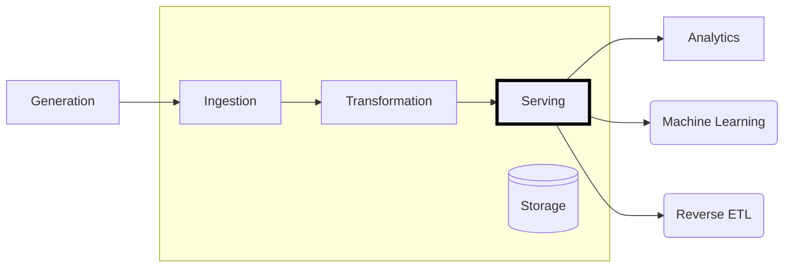
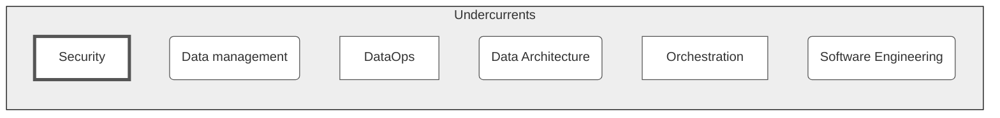

+++
title = "Data Dissemination and Security"
type = "chapter"
weight = 6

[params]
  menuPre = '<i class="fa-solid fa-upload"></i> '
+++

```mermaid {align="center" zoom="true"}
graph LR;
  classDef highlight stroke:#000,stroke-width:4px
  direction LR
  Generation
  subgraph S [ ]
    Ingestion
    Transformation
    Serving:::highlight
    Ingestion --> Transformation
    Transformation --> Serving
    Storage@{ shape: lin-cyl }
  end
  Generation --> Ingestion
  Serving --> Analytics
  Serving --> ML(Machine Learning)
  Serving --> RETL(Reverse ETL)

```

```mermaid {align="center" zoom="true"}
graph LR;
  classDef UC fill:#fff,stroke:#555
  classDef highlight stroke:#000,stroke-width:4px,fill:#fff,stroke:#555
  subgraph Undercurrents
    direction TB
    Security:::highlight
    DM(Data management):::UC
    DataOps:::UC
    DA(Data Architecture):::UC
    Orchestration:::UC
    SE(Software Engineering):::UC
    style Undercurrents fill:#eee,stroke:#000
  end
```