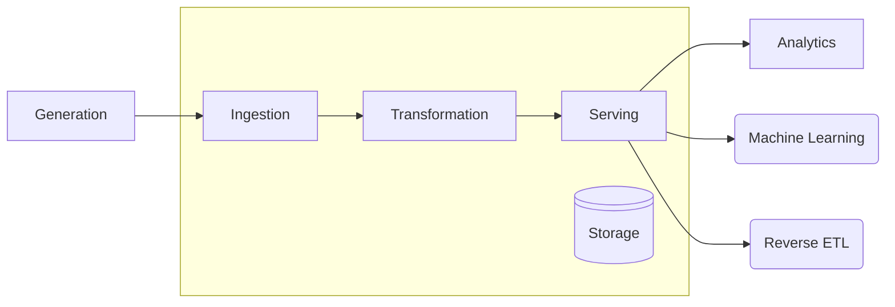
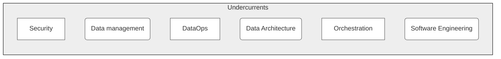

+++
title = "Introduction"
weight = -1
+++

This handbook closely follows the Data Engineering Lifecycle from the text book [Fundamentals of Data Engineering](https://www.oreilly.com/library/view/fundamentals-of-data/9781098108298/):

<figure>

  
  <figcaption>
  
  **Figure 1**: Data Engineering Lifecycle, adapted from Figure 1.1 in [Reis & Housley 2022].
  
  </figcaption>
</figure> 

