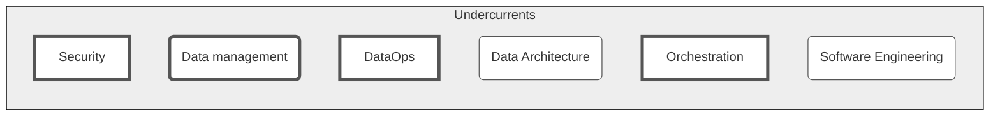

+++
title = "Data Mutability/Volatility, Robustness and Trust"
type = "chapter"
weight = 10

[params]
  menuPre = '<i class="fa-solid fa-file-shield"></i> '
+++

```mermaid {align="center" zoom="true"}
graph LR;
  classDef UC fill:#fff,stroke:#555
  classDef highlight stroke:#000,stroke-width:4px,fill:#fff,stroke:#555
  subgraph Undercurrents
    direction TB
    Security:::highlight
    DM(Data management):::highlight
    DataOps:::highlight
    DA(Data Architecture):::UC
    Orchestration:::highlight
    SE(Software Engineering):::UC
    style Undercurrents fill:#eee,stroke:#000
  end
```
