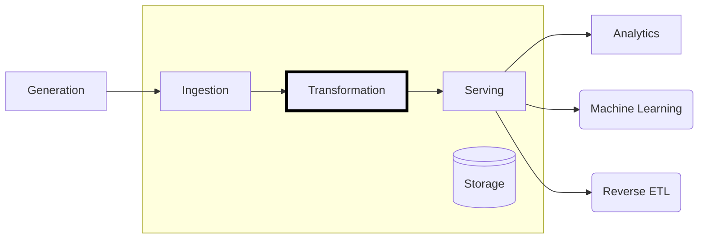

+++
title = "Data Profiling, quality and cleaning"
type = "chapter"
weight = 5

[params]
  menuPre = '<i class="fa-solid fa-list-check"></i> '
+++

```mermaid {align="center" zoom="true"}
graph LR;
  classDef highlight stroke:#000,stroke-width:4px
  direction LR
  Generation
  subgraph S [ ]
    Ingestion
    Transformation:::highlight
    Serving
    Ingestion --> Transformation
    Transformation --> Serving
    Storage@{ shape: lin-cyl }
    Storage
  end
  Generation --> Ingestion
  Serving --> Analytics
  Serving --> ML(Machine Learning)
  Serving --> RETL(Reverse ETL)
```
