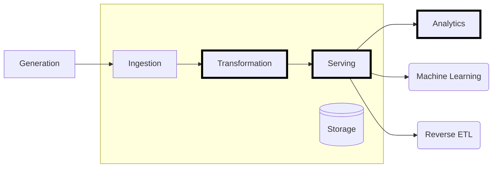

+++
title = "Data Querying"
type = "chapter"
weight = 7

[params]
  menuPre = '<i class="fa-solid fa-magnifying-glass"></i> '
+++

In this chapter we'll consider ways to query our consolidated data. A **query** is a way to ask questions to the data, to select a subset based on some filter, for instance particular attribute criteria must be met. 

## Sections

{}

