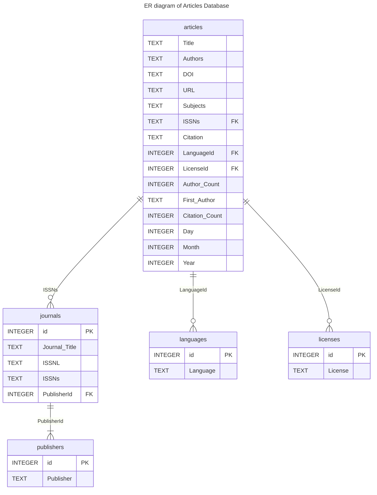

> [!primary] Objectives
> - Use Entity Relationship Diagrams to visualise and structure your data.

> [!secondary] Questions
> - What is database design?

## Spreadsheets

In libraries, spreadsheets are often created to keep lists of a variety of things like an inventory of equipment, reference statistics, or items to review for purchase (See *[What are some of the uses for SQL in libraries?](01-introduction.md)*). Spreadsheets, sometimes referred to as tabular data or flat files, are an easy way to display data organized in columns and rows. Column headers describe the data contained in corresponding columns. Each row is a record (sometimes called an observation) with data about it contained in separate column cells.

Spreadsheets can make data gathering easier but they can also lead to messy data. Over time, if you gather enough data in spreadsheets, you will likely end up with inconsistent data (i.e. misformatted, misspelled data).

> [!note]- Challenge
> > [!accent] Identifying inconsistencies in spreadsheet data
> > 
> > In the figure below, can you identify where inconsistencies in the data have been introduced?
> > 
> > 
> 
> > [!INFO]- Answers
> > 1. The data in the "Language" column is formatted in two ways, as an abbreviation and the full word;
> > 2. The full names of authors are used, in first name to last name order, with middle name abbreviated, separated by pipes;
> > 3. Date format is MM/DD/YYYY and not the commonly used ISO 8601 format;
> > 4. The "Subjects" column delimits data by pipes and the data is in a variety of formats such as abbreviations, classifications, and sometimes capitalised.
> > 
> > **Can you spot anything else?**

Designing a relational database for your data can help reduce the places where these errors can be introduced. You can also use SQL queries to find these issues and address them across your entire dataset. Before you can take advantage of all of these tools, you need to design your database.

## Database Design

Database design involves a model or plan developed to determine how the data is stored, organized and manipulated. The design addresses what data will be stored, how they will be classified, and the interrelationships between the data across different tables in the database.

## Terminology

In the [Introduction to SQL](01-introduction.md) lesson, we introduced the terms _"fields"_, _"records"_, and _"values"_. These terms are commonly used in databases while the _"columns"_, _"rows"_, and _"cells"_ terms are more common in spreadsheets. **Fields** store a single kind of information (text, integers, etc.) related to one topic (title, author, year), while **records** are a set of fields containing specific **values** related to one item in your database (a book, a person, a library).

To design a database, we must first decide what kinds of things we want to represent as tables. A table is the physical manifestation of a kind of **entity**. An entity is the conceptual representation of the thing we want to store information about in the database, with each row containing information about one entity. An entity has **attributes** that describe it, represented as fields. For example, an article or a journal is an entity. Attributes would be things like the article title, or journal ISSN which would appear as fields.

To create relationships between tables later on, it is important to designate one column as a **primary key**. A primary key, often designated as `PK`, is one attribute of an entity that distinguishes it from the other entities (or records) in your table. The primary key must be unique for each row for this to work. A common way to create a primary key in a table is to make an `id` field that contains an auto-generated integer that increases by 1 for each new record. This will ensure that your primary key is unique.

> [!TIP]
> It is [not always recommended](https://www.baeldung.com/uuid-vs-sequential-id-as-primary-key) to use auto-incremented integers as primary keys:
> * Internaly, the incrementing must be done _atomically_ to ensure uniqueness, which may slow done concurrent insertions to the database. 
> * The generated PK is not known before insertion, meaning the client has to query what was just inserted in order to use it, e.g. as a foreign key in other tables.
> * Multiple insertions of the same row (e.g. due to network issues) will add a duplicate row with a different PK
> * Concatinating equivalent tables (e.g. SQL `UNION`) will collide identifiers. 
> * An accidental `JOIN` with the wrong table will seemingly work, as all tables start from `1` and will match any FK.
> * The primary key has a tendency to leak into data exports (e.g. CSV files, APIs), exposing insertion order, which can expose business intelligence. 
> * - One trick is to shift the initial increment, e.g. add `10000000`, yet customer number `10000002` will figure out they are realistically the second customer.
> * Using `int` as PK type will overflow after 2 billion deletions/insertions. 
> 
> 
> A recommended alternative type of primary key is to generate a [Universally Unique Identifier](https://en.wikipedia.org/wiki/Universally_unique_identifier) (UUID). 
> * UUIDs are 128-bit numbers, represented as a string (e.g. `f1e47ca9-6a18-4268-902a-9fda5918fd79`). 
> * Given the number of bits, these numbers can be generated randomly with a near-zero probability of collision, and can thus be generated before insertion. 
> * With UUIDs, each PK value is globally unique (across tables, databases, servers, and companies), meaning it can safely be exposed and used as foreign key in other database system.

It is useful to describe on an abstract level the entities we would like to capture, along with how the different entities are related to each other. We do this using and entity relationship diagram (ER diagram or ERD).

## Entity Relationship Diagrams

Entity Relationship Diagrams (ER Diagram or ERD) are helpful tools for visualising and structuring your data more efficiently. They allow you to map relationships between concepts and ultimately construct a relational database. The following is an ERD of the database used in this lesson:

Relationships between entities and their attributes are represented by lines linking them together. For example, the line linking journals and publishers is interpreted as follows: The _journals_ entity is related to the _publishers_ entity through the attributes `PublisherId` and `id` respectively.

Conceptually, we know that a journal has only one publisher, but a publisher can publish many journals. This is known as a **one-to-many relationship**. In modeling relationships, we usually assign a unique identifier to the 'one' side of the relationship and use that same identifier to refer to that entity on the 'many' side. In _publishers_ table, the `id` attribute is that unique identifier. 

We use that same identifier in the _journals_ table to refer to an individual publisher. That way, there is an unambiguous way for us to distinguish which journals are associated with which publisher, in a way that keeps the integrity of the data (see [the Normalisation section](#normalisation) below).

## More Terminology

The degree of relationship between entities is known as their **cardinality**. Using the journals-publishers example, the _publishers_ table contains a **primary key** (`PK`) called `id`. When the PK is used to create a connection between the original table and a different table, it is called a **foreign key** (`FK`) in the other table. To follow the example, we see a field in the _journal_ table called `PublisherID` that contains the values from the `id` field in the _publisher_ table, connecting the two tables.

There are 4 main types of relationships between tables:

One to One
: Each item in the first table has exactly one match in the second table.

One to Many
: Each item in the first table is related to many items in the second table, sometimes represented as 1 to \* or 1 to  ∞

Many to One
: Many items in the first table is related to one item in the second table.

Many to Many
: Many items in the first table are related to many items in the second table.

In our previous example of the `PublisherID` field in the _journals_ table, the _publisher_ table has a one to many relationship with the _journals_ table. This is because one publisher may publish many journals, so it will appear multiple times in that field.

A key attribute is often included when designing databases to facilitate SQL `JOIN`s.
In this tutorial we saw the example of using [*ISSNs*](https://www.issn.org/), _International Standard Serial Number_, a internationally assigned code for published journals. Using existing unique identifiers assigned by an authority is often recommended as a PK type, assuming you have no rows that are not covered by said registry. However, they may be better be used as a **alternative key**, as in the example table _journals_ which has both **candidate keys** `id` and `ISSNs` (either field can be used as a foreign key). This allows rows in _journals_  also where an ISSN is not known (`NULL`), although they in this case can't be linked from _articles_.

## Normalisation

ERDs are helpful in normalising your data which is a process that can be used to create tables and establish relationships between those tables with the goal of eliminating redundancy and inconsistencies in the data.

In the example ERD above, creating a separate table for publishers and linking to it from the journals table via PK and FK identifiers allows us to normalise the data and avoid inconsistencies. If we used one table, we could introduce publisher name errors such as misspellings or alternate names as demonstrated below.

There are a number of normal forms in the normalisation process that can help you reduce redundancy in database tables. [Study Tonight](https://www.studytonight.com/dbms/database-normalization.php) features tutorials where you can learn more about them.

> [!note]- Challenge
> > [!accent] 
> >  ## Identifying remaining inconsistencies in the ERD
> >  Are there other tables and relationships you can create to further normalise the data and avoid inconsistencies?
> > 
> > For this exercise, you can either use pencil/pen and paper to draw new tables and relationships or use [dbdiagram.io](https://dbdiagram.io/d/5cc32b0cf7c5bb70c72fc530) to modify the ERD above.
>
> > [!INFO]- Solution
> > 1. An 'authors' table can be created with a many-to-many relationship with the 'articles' table and an [associative entity](https://en.wikipedia.org/wiki/Associative_entity) or bridge table between them.
> > 2. A 'subjects' table can be created with a many-to-many relationship with the 'articles' table and a bridge table between them.
> > 
> > **Can you spot anything else?**

 
Additional database design tutorials to consult from Lucidchart:

- [Database Structure and Design Tutorial](https://www.lucidchart.com/pages/database-diagram/database-design)
- [What is an Entity Relationship Diagram](https://www.lucidchart.com/pages/er-diagrams)

> [!TIP] Keypoints
> - Database design is helpful for creating more efficient databases.

